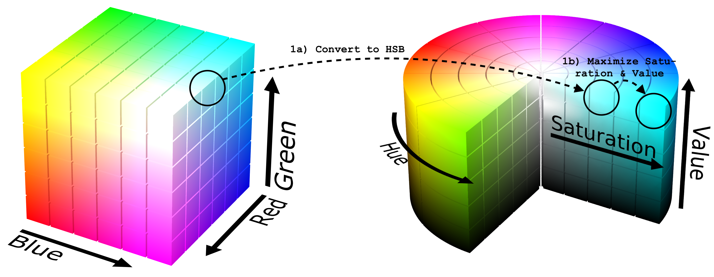
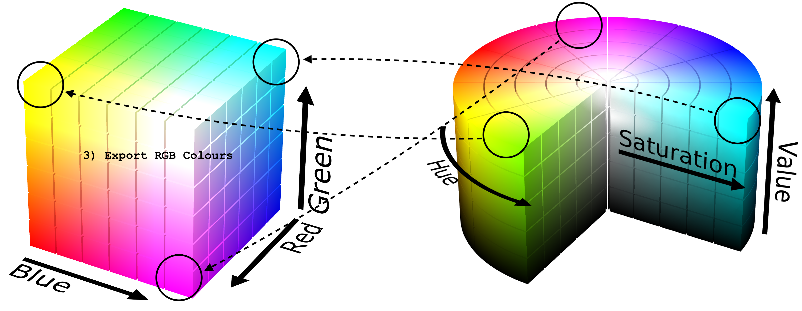

# Max Player Colours

](https://circleci.com/gh/kartoffelquadrat/MaxPlayerColours)


A tiny helper tool to optimize colours of board game players.

## About 

When it comes to board games, most players have a colour preference. Unfortunately individual choices easily lead to colour collisions or hard to distinguish player colours.  
**This tiny library offers everything you need to make everyone happy. It optimizes individual colour spaces and ranges.**

### How does it work ?

 > They key though is: *Interfaces of distinct players can apply distinct colour attributions.*

 * Let's say  *Player 1*'s favourite colour is cyan, then his game instance will display his items in cyan.
 * A second game instance can without problems display another *player 2* as cyan (and display *player 1* with any other colour).  

This library provides a simple function to compute optimized (maximally distinguishable) colours for all opponents, based on a fixed initial colour preference.

### An Example

 * *Player 1* really wants red, and there are 4 other players.
 * Call ```generateColourSet(127, 0, 0, 5)``` and this library will generate 5 optimized colours.
   * At ```index 0``` *Player 1*'s favourite colour: *Red* (Note: the colour did not change *Hue*, but was boosted in *Saturation* and *Value*, for best visibility)
   * At ```index 2``` - ```index 5```: 4 RGB encoded colours with maximizied *Saturation*, *Value* and maximized *Hue* distance.

### How does this really work ?

The colour optimization runs in three stages:

 1. Maximize *Saturation* and *Value* of origin colour, while preserving *Hue*. The provided *origin* colour is pushed from an RGB cube position to the top-outer colour ring in HSB space:  


 2. Compute optimally distributed colours. All colours have maximized *Saturation* and *Value*. Pairwise *Hue* distance is maximized:
  

 3. Export computed colours back to RGB space:
  


 > Image credits: [Wikipedia RGB](https://en.wikipedia.org/wiki/RGB_color_model) / [Wikipedia HSB](https://en.wikipedia.org/wiki/HSL_and_HSV)

## Usage

Everything you need to know to use this library:

### Old School Code Integration

You only need the two classes in the [```src```](https://github.com/kartoffelquadrat/MaxPlayerColours/tree/master/src/main/java/eu/kartoffelquadrat/maxplayercolours) folder. Feel free to paste wherever needed.

### Import as JAR

 * Alternatively you can use below maven command to compile the library into a jar file:  
```mvn clean package```
 * Your jar is then in the ```target``` folder.

### Invocation

Below is a short snippet of how to invoke the library:
 
```java
// Define reference colour (is only optimized in *Saturation* and *Value*, keeps *Hue*).
// Use any values in range [0-255]. Must not be a greyscale colour.
int r = 200;
int g = 0;
int b = 0;

// This will generate a 2D array with 3 optimized RGB colours.
int[][] colours = PlayerColourUtils.generateOptimalColours(r, g, b, 3);
```

 > See also [Java Doc](https://kartoffelquadrat.github.io/MaxPlayerColours/)!

## License / Pull Requests

 * Author: Maximilian Schiedermeier 
 * Github: [Kartoffelquadrat](https://github.com/kartoffelquadrat)
 * Webpage: https://www.cs.mcgill.ca/~mschie3
 * License: [MIT](https://opensource.org/licenses/MIT)
